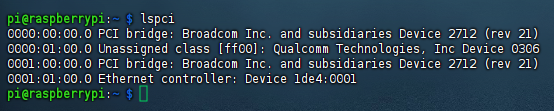
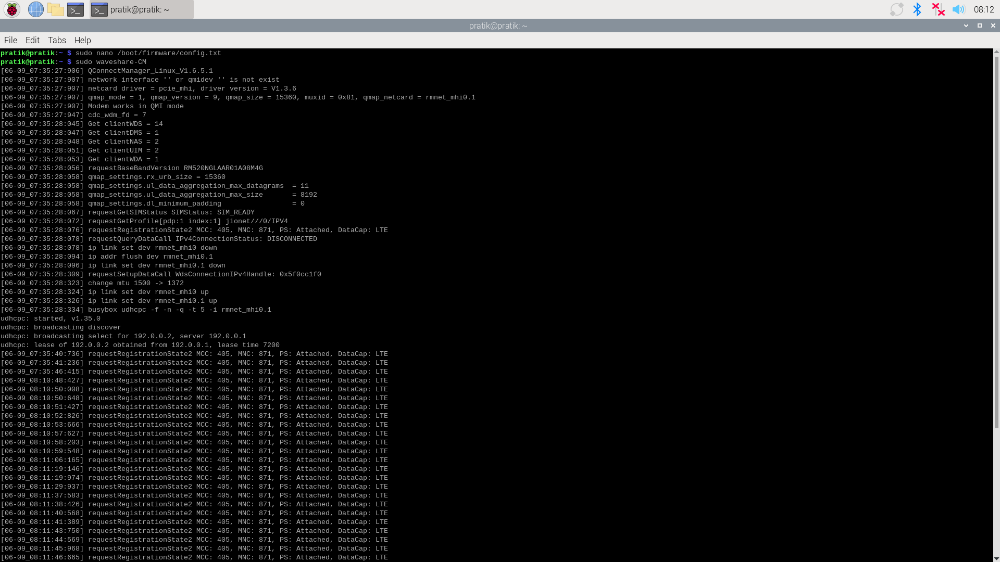
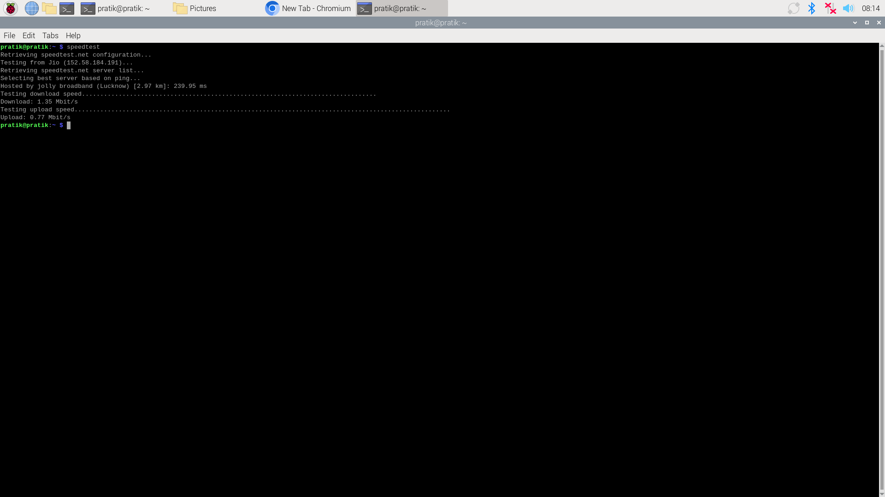
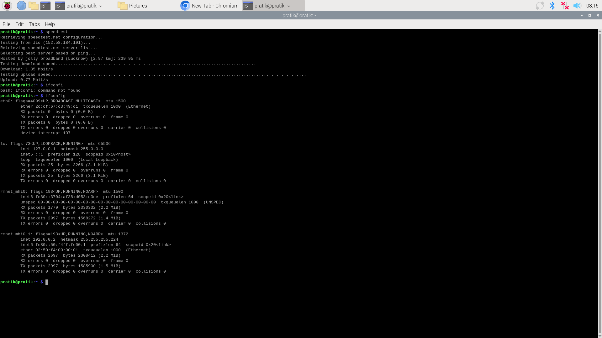

<!--
    README.md for Raspberry Pi 5G with Quectel RM520N-GL PCIe HAT+
-->

<p align="center">
  
</p>

# 🚀 Raspberry Pi 5G with Quectel RM520N-GL PCIe HAT+

> **Enable 5G internet on Raspberry Pi 5 using the Quectel RM520N-GL PCIe to 5G HAT+.**  
> This guide walks you through hardware requirements, setup steps, PCIe enablement, DIP-switch control, kernel update, and dial-up.

---

<p align="center">
  <a href="#install-raspberry-pi-os">Install OS</a> •
  <a href="#enable-pcie-support">Enable PCIe</a> •
  <a href="#dip-switch-control">DIP Switch</a> •
  <a href="#reset--power-on-off-module-with-code">GPIO Control</a> •
  <a href="#update-kernel">Kernel Update</a> •
  <a href="#verify-kernel--pcie-detection">Verify PCIe</a> •
  <a href="#dial-up-to-the-internet">Dial-up</a> •
  <a href="#power-monitoring">Power Monitor</a> •
  <a href="#dial-up-test">Dial-up Test</a>
</p>

---

## 📦 Hardware Requirements

| Component                                | Link                                                                                   |
|------------------------------------------|----------------------------------------------------------------------------------------|
| Raspberry Pi 5                           | [Raspberry Pi Store](https://www.raspberrypi.com/products/raspberry-pi-5/)             |
| USB Keyboard & Mouse                     | [Amazon India](https://www.amazon.in/s?k=usb+keyboard+mouse)                           |
| HDMI Monitor                             | [Amazon India](https://www.amazon.in/s?k=hdmi+monitor)                                 |
| Boot-ready SD Card (≥16 GB)              | [Amazon India](https://www.amazon.in/s?k=raspberry+pi+boot+sd+card)                    |
| Quectel RM520N-GL PCIe to 5G HAT+        | [Waveshare](https://www.waveshare.com/pcie-to-5g-hat-plus.htm)                         |

---

## 📋 Table of Contents

1. [Install Raspberry Pi OS](#install-raspberry-pi-os)  
2. [Enable PCIe Support](#enable-pcie-support)  
3. [DIP Switch Control](#dip-switch-control)  
4. [Reset / Power On-Off Module with Code](#reset--power-on-off-module-with-code)  
5. [Update Kernel](#update-kernel)  
6. [Verify Kernel & PCIe Detection](#verify-kernel--pcie-detection)  
7. [Dial-up to the Internet](#dial-up-to-the-internet)  
8. [Power Monitoring](#power-monitoring)  
9. [Dial-up Test](#dial-up-test)  
10. [Fallback: USB Mode via Windows & PuTTY](#fallback-switch-to-usb-mode-via-windows--putty)  

---

## 1. Install Raspberry Pi OS

<details>
<summary>Steps to flash and initial setup</summary>

1. Download **Raspberry Pi Imager** from the [official site](https://www.raspberrypi.com/software/).  
2. Flash **Raspberry Pi OS (64-bit)** onto your SD card.  
3. Insert SD card, connect keyboard, mouse, monitor, and power on the Pi.  
4. Complete first-boot setup (locale, Wi-Fi, password).

</details>

---

## 2. Enable PCIe Support

<details>
<summary>Edit <code>/boot/firmware/config.txt</code> and reboot</summary>

```bash
sudo nano /boot/firmware/config.txt
````

Add at the end:

```ini
dtparam=pciex1
dtoverlay=pciex1-debug
```

Save & reboot:

```bash
sudo reboot
```

</details>

---

## 3. DIP Switch Control

<details>
<summary>Configure on-board DIP switches (GPIO5 = RST, GPIO6 = PWR)</summary>

* **Default**: RST = ON, PWR = OFF
* Use GPIO toggling script to reset/power functions.

<p align="center">
  
</p>

</details>

---

## 4. Reset / Power On-Off Module with Code

<details>
<summary>Python script using <code>gpiozero</code></summary>

```python
import time
from gpiozero import LED

# led = LED(5)  # Control PWR
led = LED(6)    # Control RST

led.on()        # HIGH → reset/power on
time.sleep(0.5)
led.off()       # LOW → normal
```

</details>

---

## 5. Update Kernel

<details>
<summary>One-key Waveshare installer (5–10 min)</summary>

```bash
wget -O - https://files.waveshare.com/wiki/PCIe-TO-5G-HAT%2B/install.sh | sudo bash
```

After auto-reboot, verify:

```bash
uname --all
```

</details>

---

## 6. Verify Kernel & PCIe Detection

<details>
<summary>Check with <code>lspci</code> or <code>dmesg</code></summary>

```bash
lspci
# Expected:
# 02:00.0 Network controller: Qualcomm Device 0306 (rev 01)
```

Or:

```bash
dmesg | grep -i pcie
```

</details>

---

## 7. Dial-up to the Internet

```bash
sudo waveshare-CM
```

<p align="center">
  
</p>


Speed Test Results : 
<p align="center">
  
</p>

IP address asigned by Modem :
<p align="center">
  
</p>
---

## 8. Power Monitoring

<details>
<summary>Use onboard INA219 via demo script</summary>

```bash
wget https://files.waveshare.com/wiki/PCIe-TO-5G-HAT%2B/PCIe_TO_M.2_HAT%2B.zip
unzip -o PCIe_TO_M.2_HAT+.zip -d ./PCIe_TO_M.2_HAT+
cd PCIe_TO_M.2_HAT+
sudo python INA219.py
```

* Default I²C address: `0x40` (modifiable via back resistor).

</details>

---

## 9. Dial-up Test

```bash
sudo waveshare-CM
```

You should see PPP negotiation and be online.

---

## 🔄 Fallback: Switch to USB Mode via Windows & PuTTY

<details>
<summary>Steps to switch and test AT commands</summary>

1. **Connect to Windows** via USB-C.
2. **Open PuTTY** (Serial, e.g. COM3, 115200 baud).
3. **Switch to USB mode:**

   ```text
   AT+QCFG="data_interface",0,0
   AT+QCFG="usbnet",2
   ```
4. **Verify & register:**

   ```text
   AT              ← OK
   AT+CSQ          ← +CSQ: <rssi>,99 (rssi ≥ 10)
   AT+CPIN?        ← READY
   AT+COPS?        ← check registration
   AT+COPS=0       ← auto-register
   AT+CGDCONT=1,"IP","jionet"
   ```
5. **Add APNs** in Windows Settings → Network & Internet → Cellular.
6. **Reboot to PCIe mode**, re-add APN via AT if needed, then on Pi:

   ```bash
   sudo waveshare-CM
   ```

**More AT commands:** see `/documents/AT-commands.md` or Waveshare wiki:
[https://www.waveshare.com/wiki/RM520N-GL\_5G\_HAT+](https://www.waveshare.com/wiki/RM520N-GL_5G_HAT+)

</details>

---

## 🎉 You’re Done!

Your Raspberry Pi 5 is now seamlessly connected to the internet over 5G via the Quectel RM520N-GL PCIe HAT+. Enjoy ultra-fast mobile connectivity for your IoT or remote projects!

---

## 📜 License

Distributed under the MIT License. See [LICENSE](LICENSE) for details.

```
```
